---
title: Tracey's Tamalpais Thirty - 3T
date: 2022-01-16
categories:
  - biking
tags:
  - biking
  - gravel bike
featured: 3t-15.jpg
---
Wow. OMG. Words. Just had the *insanely ambitous* and most fun bikeride I've had in 15 years!  While I'm [zero-ing in on what gravel bike to buy](gravel), Hunter let me borrow his 3T Exploro Racemax new gravel bike for a ride together on a 3-day weekend.  I shot for the moon -- "let's go up Mount Tamalpais (if I even can) and try to get down the other side and ride around back to the start".  About 30 miles.  I haven't been off-road, _really_ in 25 years (with brief exception of college reunion mountain biking in Sun Valley, ID, in Sept., with my college 'mates).  Will she make it?  Will she crash?  And OMG how big are those rocks in the "trails" after rerouting from goole maps fail?!

Did I mention over 3000 feet of all offroad climbing, with most of the total miles offroad?

<iframe class="alltrails" src="https://www.alltrails.com/widget/map/map-january-21-2022-5-41-am-943b5fd?u=i" width="100%" height="400" frameborder="0" scrolling="no" marginheight="0" marginwidth="0" title="AllTrails: Trail Guides and Maps for Hiking, Camping, and Running"></iframe>


Let's start the day right - my favorite brunch of bibimbap at Kitchen Sunnyside, Mill Valley, forgoing my favorite soju-based bloody mary for a "doping" full-strength latte ;-)
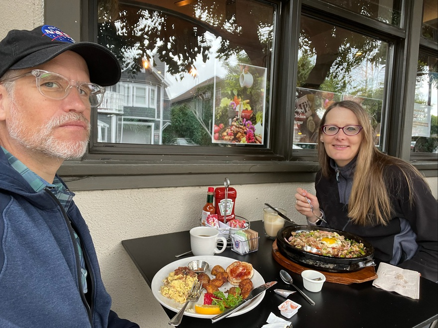

Gearing up in the Redwoods - let's do this!
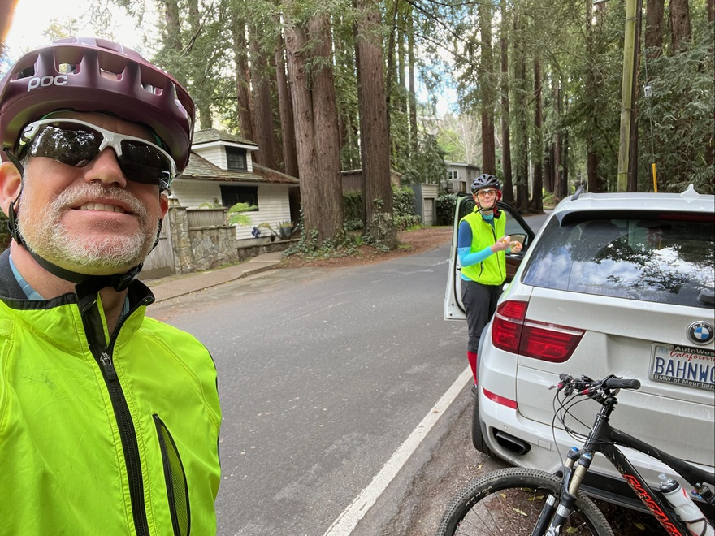

Grinning ear-to-ear -- entering "Old Railroad Grade Fire Road" and get to try out the chunky tires 3T gravel bike and see how I can do uphill :)
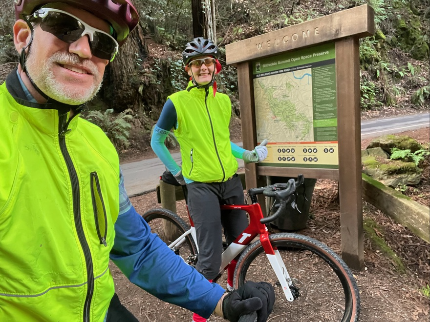

So far, so good.  Not a cakewalk, but geez this bike is capable climbing!
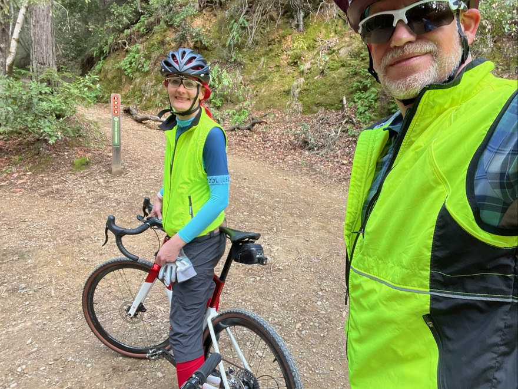
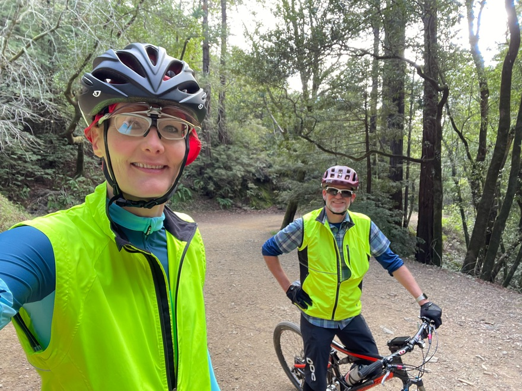

Woohoo!  Arriving at the section I've hiked a few times before and know well.  View is getting bananas and I've got lots of energy to go.
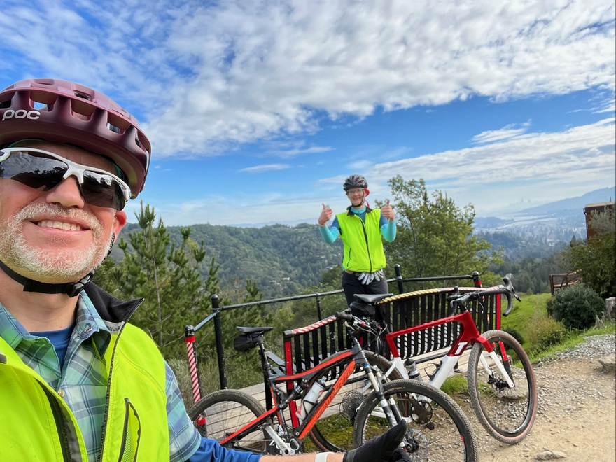

The sky and scenery is so amazing.  Brushing 70F degrees in the sun, almost no wind, _in january_ :)
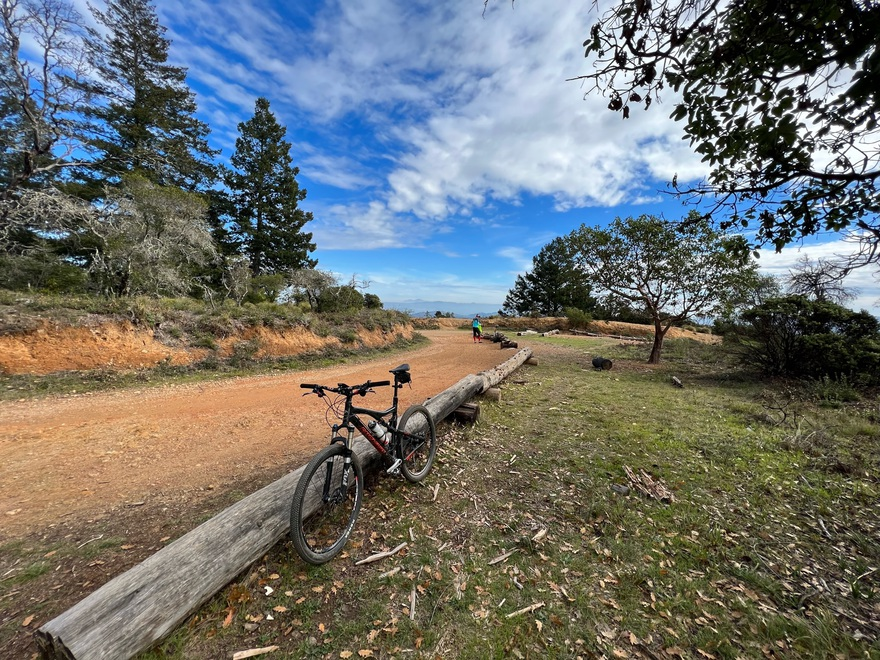

Pretty sizeable loose rocks is the norm all the way up.
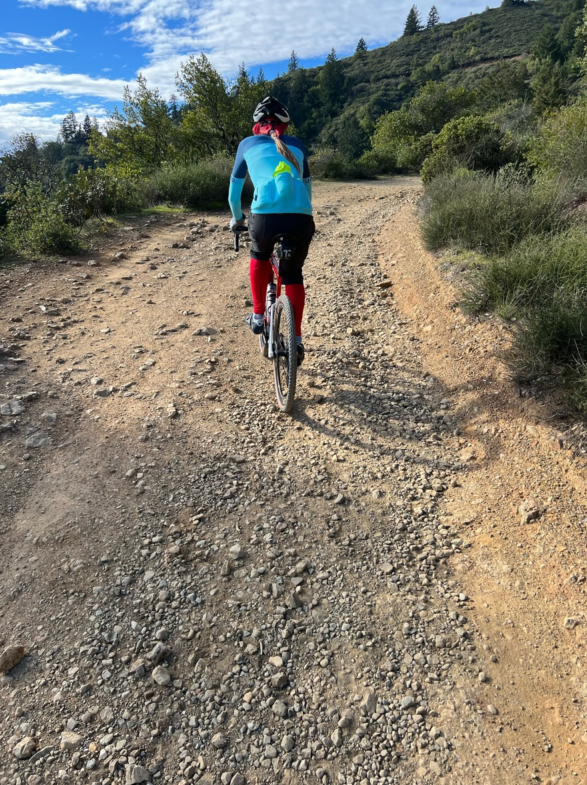

We just hit legendary West Point Inn -- only accessible to hiker and bikers.  It's the furthest I've been up Mt. Tam (only hiked once 25y ago, alternate ascent) -- so am eager to see what remains.
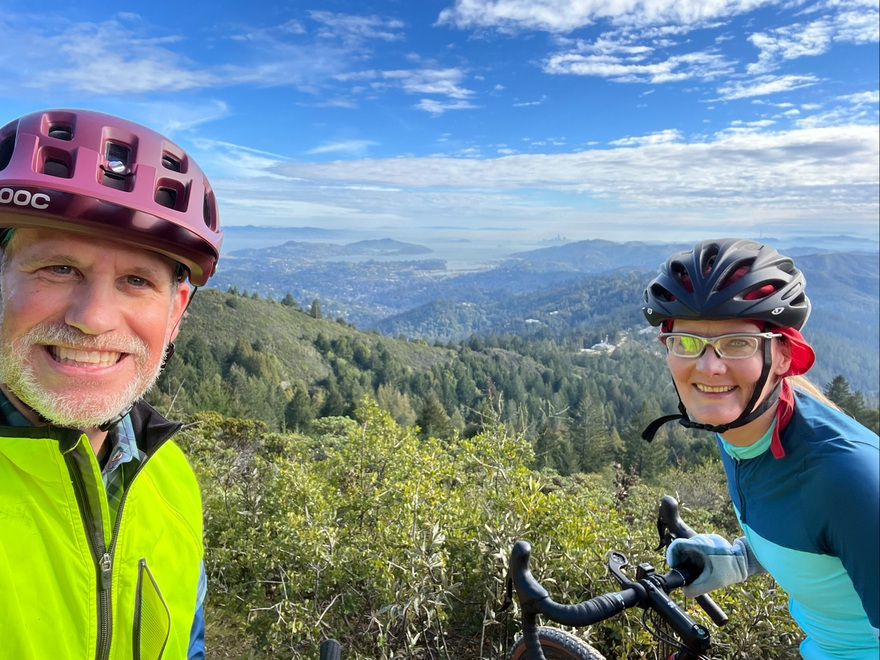
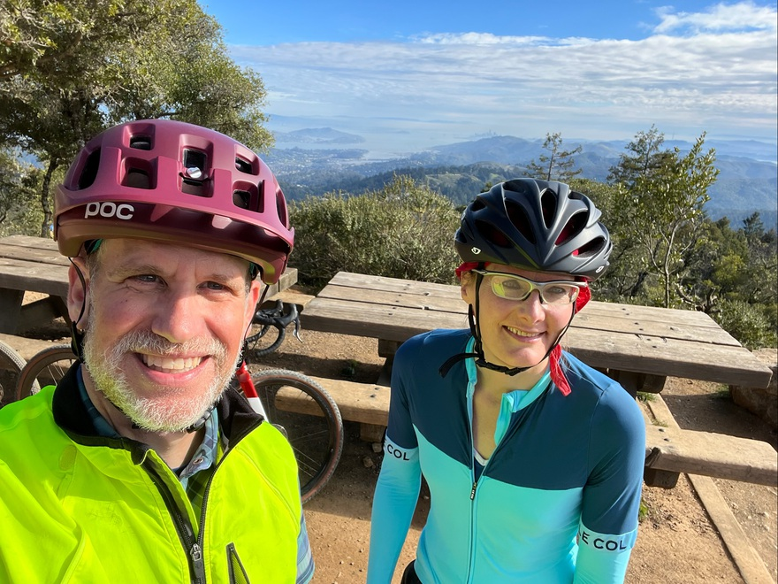
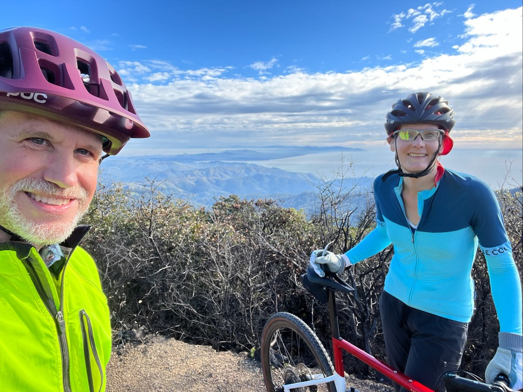

We did it!  Hit the peak and the "Gravity Car" awesome display with historical photos of the amazing "the car glides down with a brake lever and _that's it_" railroad that used to be here (and what we just biked).
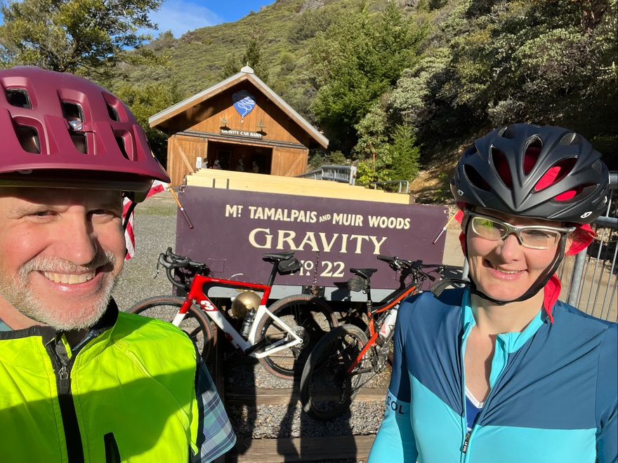

Planning our descent.  Heading to Lake Lagunitas over my left shoulder.  We had to improvise a bit to get to "Eldridge Grade" from the top, after google maps directed us to somewhere impossible.
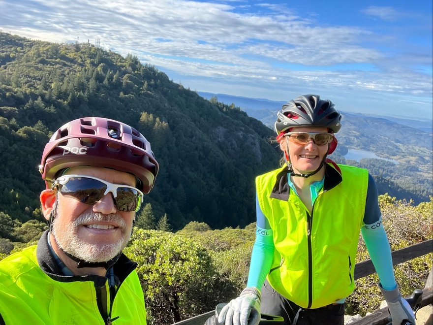

Thanks baby!  I am so soooo happy today and getting such a great way to _really_ try out a gravel bike!
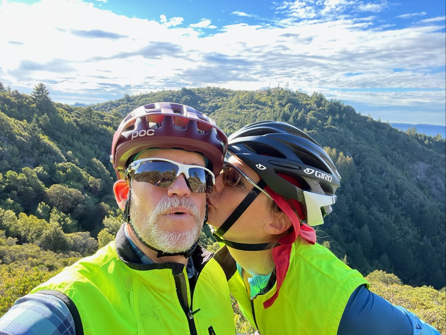

Eldridge Grade was a bee-yatch!  Holy crap, from the start, we had to walk a couple hundred feet of impassable, _terrifying_ descents.  And it didn't get much better.  I was clamped, _horrified_ on the brakes, trying desperately to not fall hard left or right and crash into _huge_ rocks, boulders, and loose all over the place.  I had no idea it would be this bad!  Thankfully, we finally made it to some fire roads that were much more doable.  Still _very_ challenging, but by then, I had figured out how to get into the "drops" on the handlebars, descending more like a cat on all fours.  You smooth the bumps out with your arms and legs, letting the rest of your body float and barely touch the seat.  And your hands have 10 times more braking power.
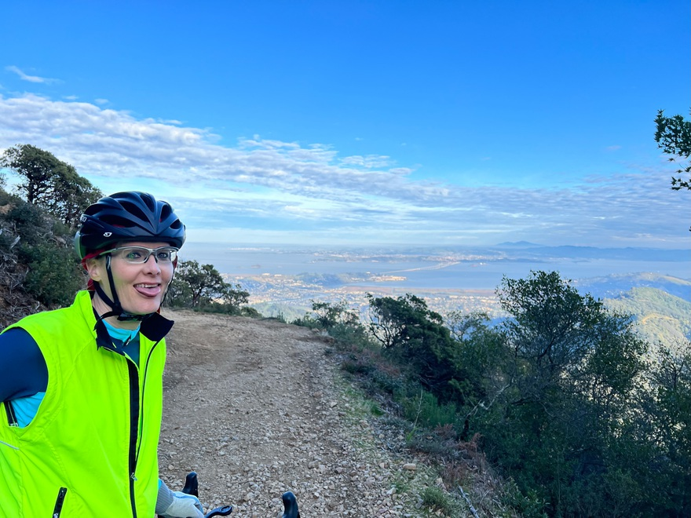

Celebratory beers and apps in Mill Valley!  I can't believe we did it and we didn't crash or get hurt.  It was _super_ dicey, requiring _absolute_ concentration in the first 45 minutes (maybe half) of the descent.  I'm so impressed by what gravel bikes can do these days!
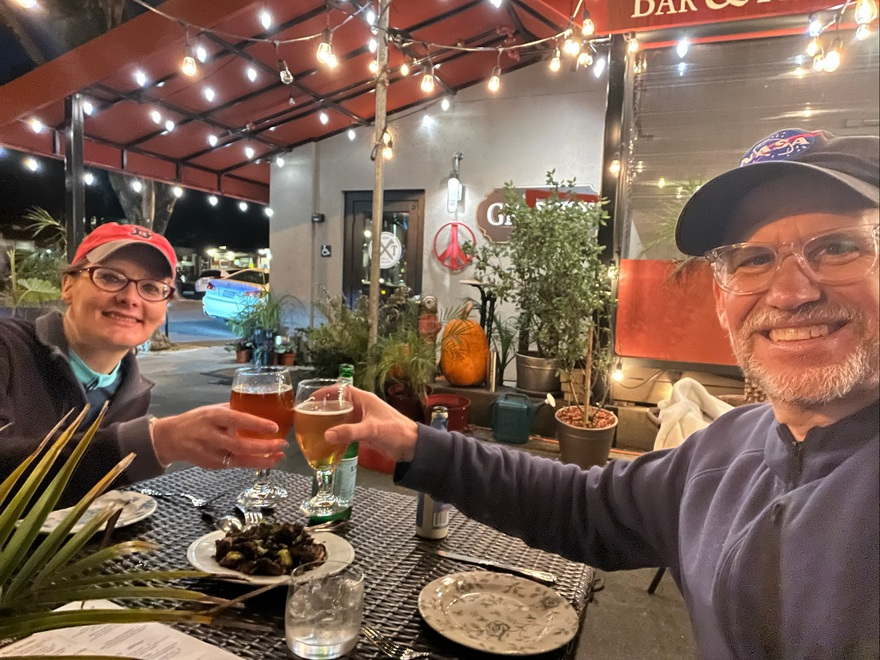

Here's what I would recommend to *avoid* the brutal downhill upper part of Eldridge Grade -- and can't wait to do next!

<iframe class="alltrails" src="https://www.alltrails.com/widget/map/mt-tam-from-mill-valley-lakes-larkspur-loop-easier-descent-265eceb?u=i" width="100%" height="400" frameborder="0" scrolling="no" marginheight="0" marginwidth="0" title="AllTrails: Trail Guides and Maps for Hiking, Camping, and Running"></iframe>

Gotta go get my own gravel bike!


---
title: 🌮 Techo Tuesday 🌮  Deno 🦕 Oh My Gawd Deno 🦕
author: tracey pooh
date: 2021-12-21
categories:
  - technical
  - techo tuesday
  - coding
tags:
  - coding
  - geek
  - javascript
featured: deno.jpg
---
_things turning me on this week_ <br/>
_☕enjoy with a hot cupa java/script_ <br/>
JavaScript is _mental_ now with `deno` --- forget `node` `npm` `package.json` `node_modules` and everything you growed up on.  This 🦕 changes _everything!_

About a year ago, an amazing coworker who shall remain anonymous ([COUGH] Drini), casually mentioned ["Deno"](https://deno.land) in a team meeting (~12 of us).  They mentioned Ryan Dahl, the creator of `node`, created this as The Next Thing.  I'd never heard of it, checked it out, got excited and was... _delflated_ seeing _full urls_ in `import` statements (instead of relative urls) since that wasn't compatible with browsers.

When a tech idea & premise is _so good_ with a fatal flaw, I _tend_ to revisit periodically...

3 months ago, to my _amazement_ -- all the main browsers were totally loading full urls, eg:
```js
import $ from 'https://esm.sh/jquery'
```

"Cancel my appointments for the month!" --- I dove in _immediately_ to kick the tires on the back-end and see if _fully_ replacing `node` for `deno` in my work (mostly backend) main repository for TV, audio & video, containing 30,000+ JS lines, might work.

In under 3 months, I migrated the entire repository to Deno.

Here's a nice browser example:

https://av.prod.archive.org/demo/deno.htm

Pay special attention to the top and later `import` statements here.

You can load logical `npm` modules directly from the web (!) 😍

Omitting (just) the pie chart setup clutter (it's a lot of JSON config for the data -- you can [see the full source here](https://av.prod.archive.org/demo/deno.js)):

```js
import $ from 'https://esm.archive.org/jquery@^3.0.0'
import dayjs from 'https://esm.archive.org/dayjs'
import * as d3v7 from 'https://esm.archive.org/d3'

import { log } from '../js/util/log.js'

window.d3 = { version: '7.0.0', ...d3v7 }

$('body').append(`
  <style>.card { width: 40%; margin: 3%; display: inline-block; vertical-align: top; }</style>
  <div id="x" class="card card-body bg-light">
    <h1>bootstrap hai whirld</h1>
    no real idea why it's working to \`import\` with urls starting with 'https://' now!
    <p> working in (at least): chrome, safari, firefox, safari iOS</p>
  </div>
  <div class="card card-body bg-light">
    <p>.. that doesnt work in \`node\` for example.</p>
    <p>.. but natively works in \`deno\`!</p>
  </div>
  <div class="card card-body bg-light">
    <h2>some dayjs stuff</h2>
    ${dayjs().format('dddd MMMM D, YYYY h:mma')}<br>
    ${dayjs().format('YYYY-MM-DD HH:mm:ss')}<br>
    ${dayjs().startOf('month').add(1, 'day').set('year', 2018)
    .format('YYYY-MM-DD HH:mm:ss')}<br>
  </div>
  <div class="card card-body bg-light">
    <h2>user privacy</h2>
    self-hosted
    <a href="https://esm.sh">esm.sh</a>
    -- at
    <a href="https://esm.archive.org">esm.archive.org</a>
    <pre>
import dayjs from 'https://esm.archive.org/dayjs'
import $ from 'https://esm.archive.org/jquery@^3.0.0'
    </pre>
  </div>

  <div id="pieChart"></div>
`)
$('#x h1').hide().fadeIn('slow')

async function dpie() {
  const d3pie = (await import('https://esm.archive.org/d3pie')).default

  const pie = new d3pie('pieChart', {
    ...
  })
}

void dpie()
```

Look how clean that is!

No need to `npm install` -- no need for `npm` or `node` whatsoever.

You can load JS from `npm` packages transpiled-on-the-fly to `import`-able JS via https://www.skypack.dev/, https://esm.sh (we host one of these on our archive.org site for user privacy), and more.

It's hard to fully articulate how weightless it feels to develop multiple repos, all without any kind of `npm install` or setup -- and just load JS files directly into the browser or backend.

You can now _make websites, blogs, and more_ entirely free, committed to and hosted at https://github.com or https://gitlab.com -- no backend needed.

Here's a fun example of charting Live Music concerts stored at https://archive.org that I live coded for
[Aaron Swartz Day 2021](https://www.aaronswartzday.org/asd-2021/)
where everything is hosted free at github:

[band recordings per year site](https://traceypooh.github.io/multi-line-chart/)

[band recordings per year source](https://github.com/traceypooh/multi-line-chart)

I'm shook!

(and won't go back)

# ❤️ 🦕


[postscript]

BTW, it took a couple months to migrate, _not_ because migrating `node` => `deno` is _particularly_ involved or long.

The conversion took awhile because:
- major delay due to needing to find a minimal porting setup for code `lint`, test, and coverage.
Ultimately, though `deno lint` is good (and blazing fast) ---
at this point --- `eslint` is still better.
I also didn't want to change my `expectations` based ES Modules `mocha` test files too much.
My next Teco Tuesday post will be about a nice testing & coverage setup.
- I decided it was time to move all synchronous/blocking network and shell-out calls to async i/o
- I decided _not_ to use any of the available `node`-compatible layer -- and instead switch everything to _native_ `deno`.

(There's only 2 files presently using a single node-compatible emulation `readdir()` call, since I already had performant complex async i/o doing parallel processing with it, running live 24x7, that I didn't want to destabilize, eg:
```js
import { readdir } from 'https://deno.land/std/node/fs/promises.ts'
```
